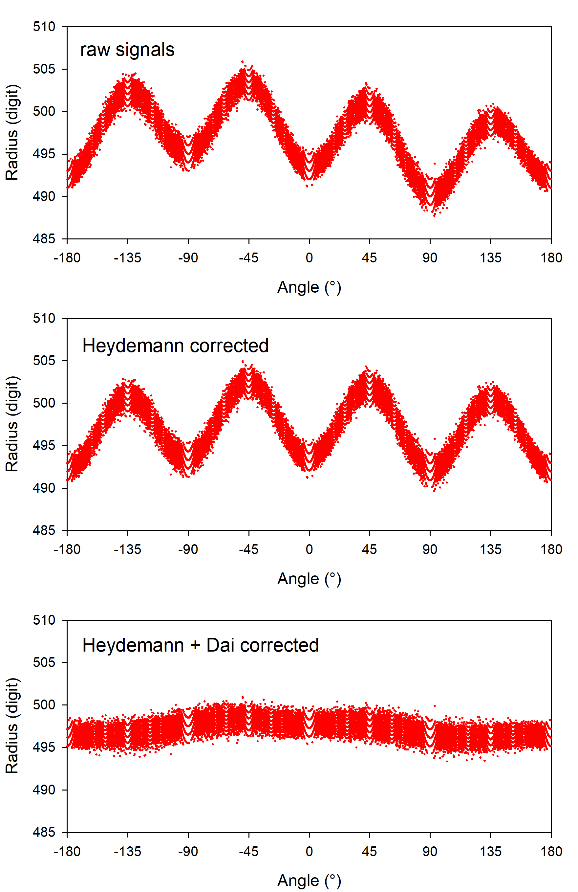
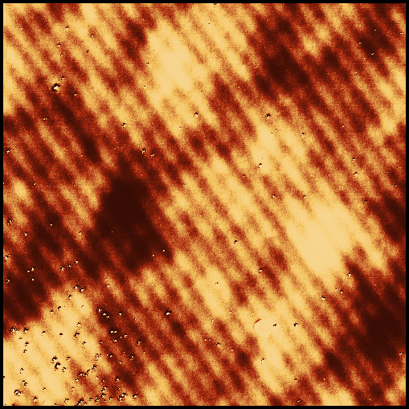
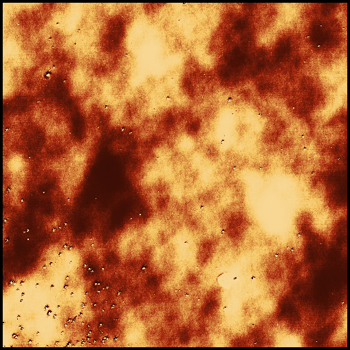

# NmmReader (At.Matus.IO.NmmReader)

C# library for reading files produced by the Nanopositioning and Nanomeasuring Machine (NMM)

## Overview

The Nanopositioning and Nanomeasuring Machine (NMM) by [SIOS GmbH](https://sios-de.com) is a versatile metrological instrument. It can perform various dimensional measurements like profile and surface scans with different sensors. Moreover, it can be operated as a µCMM for actual 3D point probing. All measurement modes are traceable due to three laser interferometers.

The system is usually operated by a custom software (nmmcontrol.exe) running in a MS Windows environment. The results are stored in a multitude of text files with proprietary data formats. Depending on the measurement mode (scan or 3D mode, respectively) a number of different files are produced. The nonstandard data format together with some bugs in the control software complicates the correct data interpretation somewhat. This fact is reflected in the complex structure of this library.

The API of this library allows to handle files produced by either mode in a consistent way. 

### Known problems in the input files

All currently tested versions of nmmcontrol.exe cause some peculiar problems.

* Some keywords contain spelling errors.

* Due to bugy cache handling, remnants of old measurements appear in some files.

* Data points can be missing in some profiles.

* Depending on the operating system's localization, dates may be stored with unusual month names. In these cases, this library may generate incorrect time metadata.

* Non-ASCII characters can be misinterpreted.

Some of the identified problems might (unlikely) be fixed in a future version of nmmcontrol.exe. An adjustment to this library would then be necessary.

## Library structure

The library is composed of a lot of classes. Some classes are needed for both modi of operations, others are specific for the surface scan or 3D mode, respectively.

### Common classes

* `NmmFileName`
Handles the different file name extensions produced by the control software in either mode. The possibility to repeat measurement tasks is mapped by this class also.
 
* `NmmInstrumentCharacteristics`
Provides properties of the specific instrument, site and operator. Since this information is not extractable from the data files it must be hard-wired in this class.
 
* `NmmEnvironmentData`
Encapsulates the download of environmental sensor data recorded by a measurement on the NMM. Evaluated parameters are provided as properties. All valid *.pos files are automatically consumed by this class: Scan files (forward and backward), 3D-files, with or without sample temperature sensor channel.

* `NmmDescriptionFileParser`
Class consumes description files (*.dsc) produced during either a scan or a 3D measurement on the NMM. Backtrace description files are ignored.

 
### Scan specific classes

* `NmmScanData`
This is the main class for reading surface scans. Class to handle topographic surface scan data (including all metadata) of the NMM.
 
* `TopographyData`
Class to store and retrieve the topographic surface scan data of the NMM.
 
* `ScanMetaData`
A container class for metadata of a NMM scan file collection.
 
* `ScanColumnPredicate`
A simple container class to hold the title and corresponding measurement unit for the data columns of NMM scan files.
 
* `Scan`
A convenient container for some methods used to evaluate NMM scan files.
 
* `NmmIndFileParser`
This Class consumes the index files (*.ind) produced during a scan on the SIOS NMM. The data is provided by properties only, there are no public methods.
 
* `NmmDatFileParser`
Class to read the topographic surface scan data of the NMM. Data is read line per line from the (usually) two *.dat files.

### 3D mode specific classes

* `ObjectType`
This is an enumeration for the predefined 3D objects (like spheres or planes) which can be measured with the NMM software.

3D mode is not implemented yet.

## Correction of Interferometric Nonlinearity Errors

TBA

## Site specific metadata
The files generated by nmmcontrol.exe do not contain any information about the instrument, the user, or his affiliation. This metadata must be stored in a separate file located in the same path as the DLL. It is a simple XML file with the predefined name NmmInstrumentCharacteristics.xml.

## Installation and usage
If you do not want to build the libraries from the source code you can use the released binaries. Just copy the .dll files to the directory of the calling app.

## Dependencies and Acknowledgments

* [At.Matus.StatisticPod](https://github.com/matusm/At.Matus.StatisticPod)
* [Math.NET numerics](https://numerics.mathdotnet.com)

---

**Note**: This library is not officially affiliated with or endorsed by SIOS Meßtechnik GmbH.
